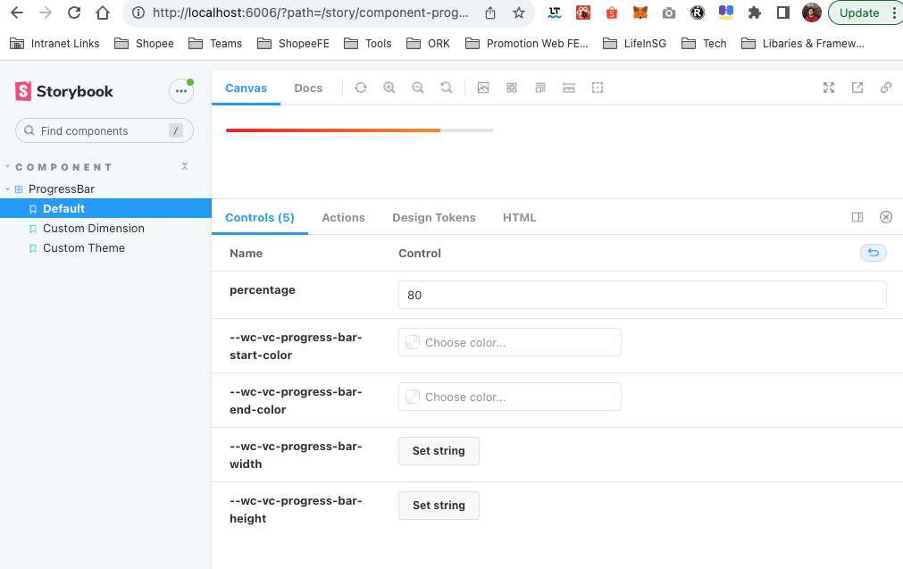

# cnp-template-lit-component

> A bolierplate for creating [lit](https://github.com/lit/lit) component with typescript, storybook;
>
> A bolierplate for that can be used by [create-npm-package](https://github.com/hsuehic/create-npm-package)

## Usage

```bash
npx create-npm-packages my-components --template hsuehic/cnp-template-lit-component
cd my-components
npm ci
npm run storybook
```



# WC-PROGRESS-BAR

[](https://www.npmjs.com/package/wc-progress-bar)
[](http://www.npmtrends.com/wc-progress-bard)
[](https://github.com/hsuehic/cnp-template-lit-component/actions/workflows/test.yaml/badge.svg?branch=main)
[](https://github.com/hsuehic/cnp-template-lit-component/actions/workflows/lint.yaml/badge.svg?branch=main)
[](https://github.com/hsuehic/cnp-template-lit-component/actions/workflows/pages.yaml/badge.svg?branch=main)

A Web Component for displaying progress. Please check [Demos](https://hsuehic.github.io/cn-template-lit-component/).

## Installation

```bash

npm i wc-progress-bar

```

## Usage

### Without bundler

```html
    <script type="module" src="path/to/progress-bar.js""></script>
    <progress-bar percentage="60"></progress-bar>
      <progress-bar
        percentage="80"
        style="
          --wc-vc-progress-bar-width: 350px;
          --wc-vc-progress-bar-height: 5px;
        "
      ></progress-bar>
      <progress-bar
        percentage="50"
        style="
          --wc-vc-progress-bar-width: 100%;
          --wc-vc-progress-bar-height: 6px;
          --wc-vc-progress-bar-start-color: #00f;
          --wc-vc-progress-bar-end-color: #0f0;
        "
      ></progress-bar>

```

### With bundler such as Webpack, rollup

- Step 1, import the module in your script file

  ```js
  import 'wc-progress-bar';
  ```

- Step 2, add element with markup

  ```html
  <progress-bar percentage="60"></progress-bar>
  ```

### Memo

TSConfig: `useDefineForClassFields`

- Dev Server(Esbuild)

```js
{
  // target before es2020, such as es
  constructor() {
    super();
    this.props= value;
  }
}

```

- Storybook(Babel): <https://github.com/storybookjs/storybook/issues/12578>
  
  The sequence of the decorator matters.

```js
// target later than 2022
{
  @observable()
  percentage = 0;
}
```

- storybook-design-token postcss
  Need to obviously install the dependencies
  <https://stackoverflow.com/questions/72272219/stylelint-gives-error-class-extends-value-undefined-is-not-a-constructor-or-nul>
