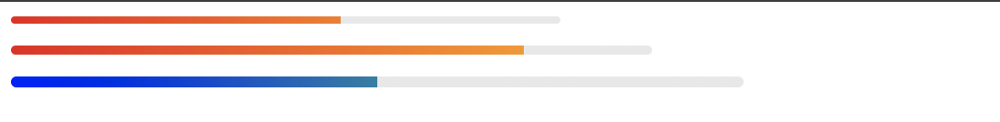

# Progress Bar Web Component powered by Lit

A Web Component for displaying progress.



## Installation

```bash

npm i wc-progress-bar

```

## Usage

### Without bundler

```html
    <script type="module" src="path/to/progress-bar.js""></script>
    <progress-bar percentage="60"></progress-bar>
      <progress-bar
        percentage="80"
        style="
          --wc-vc-progress-bar-width: 350px;
          --wc-vc-progress-bar-height: 5px;
        "
      ></progress-bar>
      <progress-bar
        percentage="50"
        style="
          --wc-vc-progress-bar-width: 100%;
          --wc-vc-progress-bar-height: 6px;
          --wc-vc-progress-bar-start-color: #00f;
          --wc-vc-progress-bar-end-color: #0f0;
        "
      ></progress-bar>

```

### With bundler such as Webpack, rollup

- Step 1, import the module in your script file

  ```js
  import 'wc-progress-bar';
  ```

- Step 2, add element with markup

  ```html
  <progress-bar percentage="60"></progress-bar>
  ```

### Memo

TSConfig: `useDefineForClassFields`

- Dev Server(Esbuild)

```js
{
  // target before es2020, such as es
  constructor() {
    super();
    this.props= value;
  }
}

```

- Storybook(Babel): https://github.com/storybookjs/storybook/issues/12578

```js
// target later than 2022
{
  @observable()
  percentage = 0;
}
```
